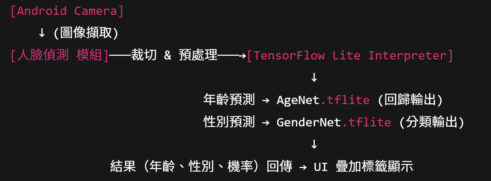

## 一、專題名稱  
**Android + Python 嵌入式年齡與性別預測系統**

---

## 二、背景與動機  
- 隨著邊緣運算需求增加，將 AI 推論下放到行動裝置可降低延遲並保護使用者隱私  
- 年齡與性別推論是智慧零售、社群互動、行銷分析等多元應用的重要基礎  
- 本專題藉由整合 TensorFlow Lite 與 Android 平台，實現「即拍即看」的人臉年齡及性別預測  

---

## 三、專題目標  
1. 自行訓練 AgeNet（年齡回歸）與 GenderNet（性別分類）模型，並量化轉檔為 `.tflite`  
2. 在 Android 應用中嵌入人臉偵測（MediaPipe 或 OpenCV DNN）與 TFLite 模型，完成即時推論功能  
3. 以「XX 歲，男性／女性」可視化標籤疊加在 Camera Preview 上；並測試不同裝置效能  

---

## 四、技術架構  

---

## 五、開發流程  
1. **資料蒐集與前處理**  
   - 下載 UTKFace 與 Adience 資料集，解析檔名獲取年齡／性別標籤  
   - MediaPipe 或 Dlib 偵測人臉並裁切為 128×128 影像，標準化像素值，設計資料增強  

2. **模型設計與訓練**  
   - AgeNet：輕量 CNN + MAE 損失，輸出連續年齡  
   - GenderNet：相同特徵提取層 + Softmax 分類  
   - 在 Google Colab GPU 上訓練、加入早停與學習率調度，監控 MAE 與準確率指標  

3. **TensorFlow Lite 轉檔**  
   - 啟用動態範圍量化，生成 `agenet.tflite`、`gendernet.tflite`，檔案大小控制在 1–2 MB  

4. **Android 端整合**  
   - 引入 TFLite Task Vision、GPU Delegate；實現影像擷取、預處理、推論、後處理、UI 疊加  
   - 利用 Profiler 測試不同設備推論延遲，優化模型量化與委派策略  

---

## 六、時程規劃  
| 週次   | 內容                             | 產出成果                     |
| ------ | -------------------------------- | ---------------------------- |
| 1      | 環境設定、資料集準備             | 資料處理程式、分割後資料      |
| 2–3    | 模型設計、訓練與驗證             | AgeNet/GenderNet Keras 模型檔 |
| 4      | TFLite 轉檔與量化                | `.tflite` 檔案               |
| 5–6    | Android 應用開發與整合           | Android App 原型             |
| 7      | 效能測試、優化與跨裝置相容性驗證 | 效能報告與優化版 App         |
| 8      | 文件撰寫、投影片製作與簡報彩排   | 完整期末報告與簡報           |

---

## 七、成果預期  
- 實現低於 30 ms 的即時推論體驗，年齡 MAE < 5 歲、性別準確率 > 90%  
- 提供可用於智慧零售、社群互動的模組化 Android SDK 介面  
- 完成專題報告、原始碼管理（GitHub）、實機 Demo 影片與簡報  

## 參考資料連結

- **UTKFace 資料集 (原始版)**：20,000+ 張人臉影像，年齡範圍 0–116 歲，可作為年齡與性別預測訓練用。  
  https://www.kaggle.com/datasets/jangedoo/utkface-new  

- **UTKFace 資料集 (Aligned & Cropped 版)**：已對齊並裁切的人臉影像，方便直接用於模型訓練。  
  https://www.kaggle.com/datasets/moritzm00/utkface-cropped 

- **Adience Dataset (官方頁面)**：26,580 張真實拍攝人臉照片，包含年齡分組與性別標註。  
  https://talhassner.github.io/home/projects/Adience/Adience-data.html 

- **Adience Dataset (Kaggle 版)**：Kaggle 上整理的 Adience 年齡與性別分類資料。  
  https://www.kaggle.com/datasets/ttungl/adience-benchmark-gender-and-age-classification 

- **deepinx/age-gender-estimation**：輕量級 AgeNet/GenderNet MXNet 實作，模型大小約 1 MB，CPU 單核 10 ms 推論。  
  https://github.com/deepinx/age-gender-estimation 

- **shubham0204/Age-Gender_Estimation_TF-Android**：示範 Keras 訓練與 Colab Notebook，自動匯出 `.tflite` 模型並整合至 Android。  
  https://github.com/shubham0204/Age-Gender_Estimation_TF-Android 

- **TensorFlow Lite Task Vision API**：針對影像任務（分類、偵測、分割等）的高階 TFLite Task Library。  
  https://ai.google.dev/edge/litert/libraries/task_library/overview 

- **TensorFlow Lite Converter 文件**：介紹如何使用 Python API 或命令列將 Keras/TF 模型轉換為 `.tflite`。  
  https://www.tensorflow.org/api_docs/python/tf/lite/TFLiteConverter 

- **Chaquopy 官方文件**：Android 中嵌入 Python 的 SDK，支援 NumPy、SciPy、OpenCV 等常見 Python 套件。  
  https://chaquo.com/chaquopy/documentation/ 

- **shubham0204/Age-Gender_Estimation_TF-Android Releases**：App 範例版本與更新紀錄，包括 Jetpack Compose 與 GPU Delegate 支援。  
  https://github.com/shubham0204/Age-Gender_Estimation_TF-Android/releases  

- **MediaPipe Face Detection (Python 解決方案)**：Google MediaPipe 臉部偵測，可取得 6 個邊界框與關鍵點。  
  https://github.com/google/mediapipe/blob/master/mediapipe/python/solutions/face_detection.py  

- **dlib C++ Library**：高品質人臉偵測與特徵點萃取工具，可作人臉裁切與對齊。  
  https://dlib.net/  

- **Google Colaboratory**：雲端 Jupyter Notebook 平台，免費提供 GPU/TPU 訓練環境。  
  https://colab.research.google.com/  
